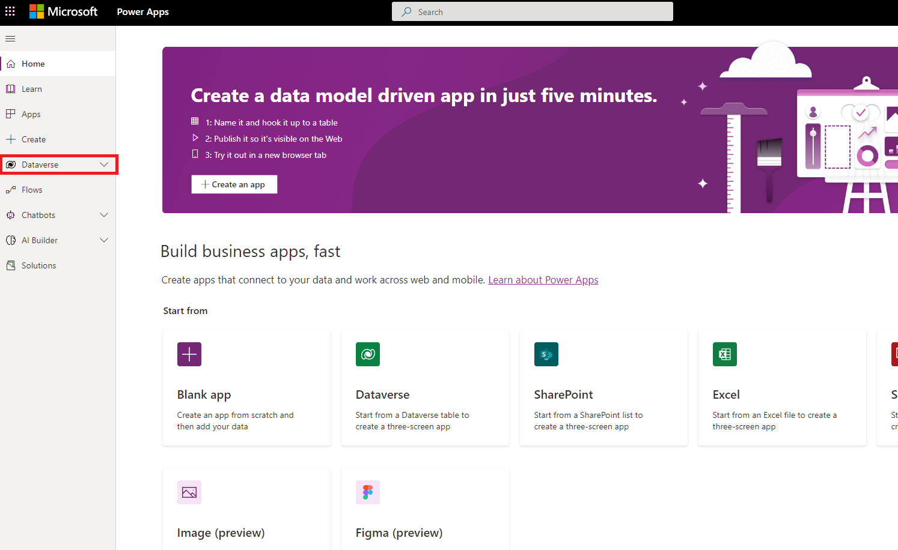
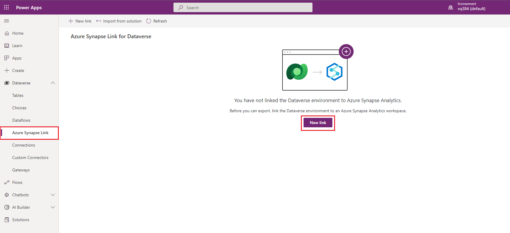
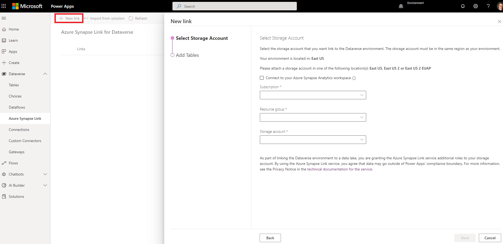
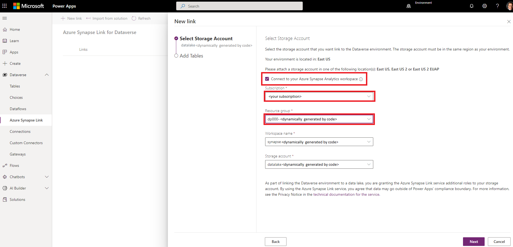
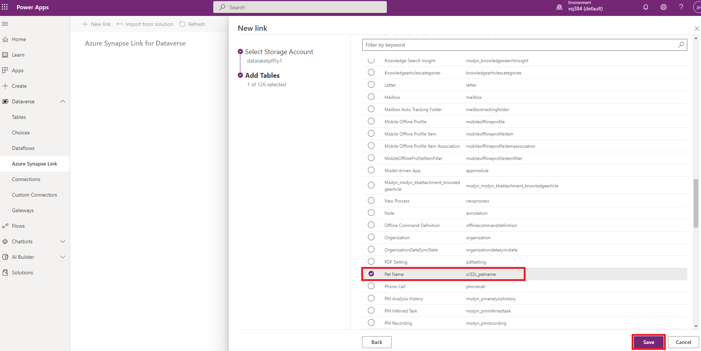

---
lab:
    title: 'Use Azure Synapse Link for Dataverse'
    module: 'Use Azure Synapse Link'
---

# Use Azure Synapse Link for Dataverse

Azure Synapse Link for Dataverse enables you to automatically synchronize a structure in dataverse  with a dedicated SQL pool in Azure Synapse Analytics. This synchronization enables you to perform low-latency analytical workloads in Synapse Analytics without incurring query overhead in the source operational database.

This lab will take approximately **35** minutes to complete.

## Before you start

You'll need an [Azure subscription](https://azure.microsoft.com/free) in which you have administrative-level access.

You'll need to setup or have access with appropriate permissions to a Dataverse Table which can be accomplished by using the [Create tables in Dataverse module.](https://docs.microsoft.com/en-us/learn/modules/get-started-with-powerapps-common-data-service/)

## Provision Azure resources

In this exercise, you'll synchronize data from an Azure SQL Database resource to an Azure Synapse Analytics workspace. You'll start by using a script to provision these resources in your Azure subscription.

1. Sign into the [Azure portal](https://portal.azure.com).
2. Use the **[\>_]** button to the right of the search bar at the top of the page to create a new Cloud Shell in the Azure portal, selecting a ***PowerShell*** environment and creating storage if prompted. The cloud shell provides a command line interface in a pane at the bottom of the Azure portal, as shown here:

    

    > **Note**: If you have previously created a cloud shell that uses a *Bash* environment, use the the drop-down menu at the top left of the cloud shell pane to change it to ***PowerShell***.

3. Note that you can resize the cloud shell by dragging the separator bar at the top of the pane, or by using the **&#8212;**, **&#9723;**, and **X** icons at the top right of the pane to minimize, maximize, and close the pane. For more information about using the Azure Cloud Shell, see the [Azure Cloud Shell documentation](https://docs.microsoft.com/azure/cloud-shell/overview).

4. In the PowerShell pane, enter the following commands to clone this repo:

    ```
    rm -r dp-000 -f
    git clone https://github.com/MicrosoftLearning/mslearn-synapse dp-000
    ```

5. After the repo has been cloned, enter the following commands to change to the folder for this lab and run the **setup.ps1** script it contains:

    ```
    cd dp-000/Allfiles/Labs/08
    ./setup.ps1
    ```

6. If prompted, choose which subscription you want to use (this will only happen if you have access to multiple Azure subscriptions).
7. When prompted, enter a suitable password for your Azure SQL Database.

    > **Note**: Be sure to remember this password!

8. Wait for the script to complete - this typically takes around 15 minutes, but in some cases may take longer. While you are waiting, review the [What is Azure Synapse Link for Dataverse?](https://docs.microsoft.com/en-us/power-apps/maker/data-platform/export-to-data-lake) article in the Azure Synapse Analytics documentation.

## Provision Dataverse Resource

In this exercise we're going to connect to the synapse instance and storage account in the resource group we just created. 
> **[!IMPORTANT]**
> The system currently supports only the use of *East US, East US 2, and East US 2 EAUP regions* for storage accounts which may impact your ability to complete  this portion of the lab.

1. Sign into [PowerApps](https://make.preview.powerapps.com/)
2. Expand the Dataverse section:



3. Select the **Select Synapse Link**.



4. select **New Link**.



5. select the button under *Select Storage Account* named **Connect to your Azure Synapse Analytics Workspace**.
6. In the drop-down under *Subscription*, select the subscription you provisioned the Azure Resources.
7. In the drop-down under *Resource Group*, select the resource group that starts with **dp000-** 
   
> [!NOTE]
> You can refer to the powershell output for the full name of the randomly generated number.

8. Once you select the *Resource Group*, you should see the *Workspace name* and *Storage account* populate automatically.
   


9. The next step is to select the table to link, if you followed the directions from the pre-requesites, you will have a *Pet Name* table, select this table and then click **Save**


10. 
## Delete Azure resources

If you've finished exploring Azure Synapse Analytics, you should delete the resources you've created to avoid unnecessary Azure costs.

1. Close the Synapse Studio browser tab and return to the Azure portal.
2. On the Azure portal, on the **Home** page, select **Resource groups**.
3. Select the **dp000-*xxxxxxx*** resource group that was created by the setup script at the beginning of this exercise.
4. At the top of the **Overview** page for your resource group, select **Delete resource group**.
5. Enter the **dp000-*xxxxxxx*** resource group name to confirm you want to delete it, and select **Delete**.

    After a few minutes, your resource group and the resources it contained will be deleted.

