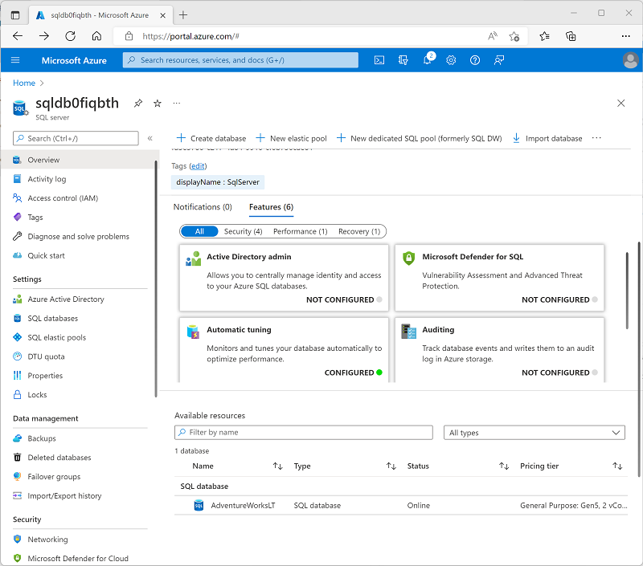
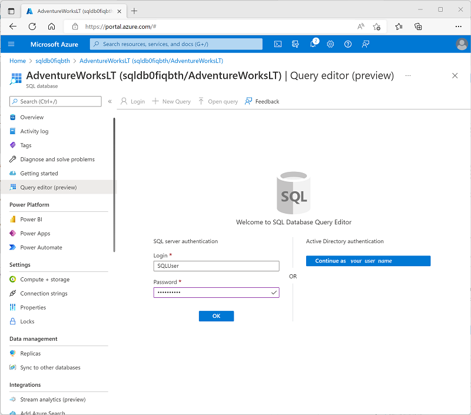

---
lab:
    title: 'Use Azure Synapse Link for SQL'
    module: 'Use Azure Synapse Link'
---

# Use Azure Synapse Link for SQL

# UNDER DEVELOPMENT....


Azure Synapse Link for SQL enables you to automatically synchronize a transactional database in SQL Server or Azure SQL Database with a dedicated SQL pool in Azure Synapse Analytics. This synchronization enables you to perform low-latency analytical workloads in Synapse Analytics without incurring query overhead in the source operational database.

This lab will take approximately **35** minutes to complete.

## Before you start

You'll need an [Azure subscription](https://azure.microsoft.com/free) in which you have administrative-level access.

## Provision Azure resources

In this exercise, you'll synchronize data from an Azure SQL Database resource to an Azure Synapse Analytics workspace. You'll start by using a script to provision these resources in your Azure subscription.

1. Sign into the [Azure portal](https://portal.azure.com).
2. Use the **[\>_]** button to the right of the search bar at the top of the page to create a new Cloud Shell in the Azure portal, selecting a ***PowerShell*** environment and creating storage if prompted. The cloud shell provides a command line interface in a pane at the bottom of the Azure portal, as shown here:

    

    > **Note**: If you have previously created a cloud shell that uses a *Bash* environment, use the the drop-down menu at the top left of the cloud shell pane to change it to ***PowerShell***.

3. Note that you can resize the cloud shell by dragging the separator bar at the top of the pane, or by using the **&#8212;**, **&#9723;**, and **X** icons at the top right of the pane to minimize, maximize, and close the pane. For more information about using the Azure Cloud Shell, see the [Azure Cloud Shell documentation](https://docs.microsoft.com/azure/cloud-shell/overview).

4. In the PowerShell pane, enter the following commands to clone this repo:

    ```
    rm -r dp-000 -f
    git clone https://github.com/MicrosoftLearning/mslearn-synapse dp-000
    ```

5. After the repo has been cloned, enter the following commands to change to the folder for this lab and run the **setup.ps1** script it contains:

    ```
    cd dp-000/Allfiles/Labs/09
    ./setup.ps1
    ```

6. If prompted, choose which subscription you want to use (this will only happen if you have access to multiple Azure subscriptions).
7. When prompted, enter a suitable password for your Azure SQL Database.

    > **Note**: Be sure to remember this password!

8. Wait for the script to complete - this typically takes around 15 minutes, but in some cases may take longer. While you are waiting, review the [What is Azure Synapse Link for SQL?](https://docs.microsoft.com/azure/synapse-analytics/synapse-link/sql-synapse-link-overview) article in the Azure Synapse Analytics documentation.

## Configure Azure SQL Database

Before you can set up Azure Synapse Link for your Azure SQL Database, you must ensure that the required configuration settings have been applied in your Azure SQL Database server.

1. In the [Azure portal](https://portal.azure.com), browse to the **dp000-*xxxxxxx*** resource group that was created by the setup script, and select your **sqldb*xxxxxxxx*** Azure SQL server.

    > **Note**: be careful not to mix up the Azure SQL server resource **sqldb*xxxxxxxx***) and the Azure Synapse Analytics dedicated SQL pool (**sql*xxxxxxxx***).

2. In the page for your Azure SQL Database resource, in the pane on the left, in the **Security** section (near the bottom), select **Identity**. Then under **System assigned managed identity**, set the **Status** option to **On**. Then use the **&#128427; Save** icon to save your configuration change.

    

3. In the pane on the left, in the **Security** section, select **Networking**. Then, under **Firewall rules**, select the exception to **Allow Azure services and resources to access this server**.

4. Use the **&#65291; Add a firewall rule** button to add a new firewall rule with the following settings:

    | Rule name | Start IP | End IP |
    | -- | -- | -- |
    | AllClients | 0.0.0.0 | 255.255.255.255 |

    > **Note**: This rule allows access to your server from any Internet-connected computer. We're enabling this to simplify the exercise, but in a production scenario you should restrict access to only network addresses that need to use your databases.

5. Use the **Save** button to sve your configuration change:

    

## Explore the transactional database

Your Azure SQL server hosts a sample database named **AdventureWorksLT**. This database represents a transactional database used for operational application data.

1. In the **Overview** page for your Azure SQL server, at the bottom of the, select the **AdventureWorksLT** database:

    

2. In the **AdventureWorksLT** database page, select the **Query editor** tab and log in using SQL server authentication with the following credentials:
    - **Login** SQLUser
    - **Password**: *The password you specified when running the setup script.*


    