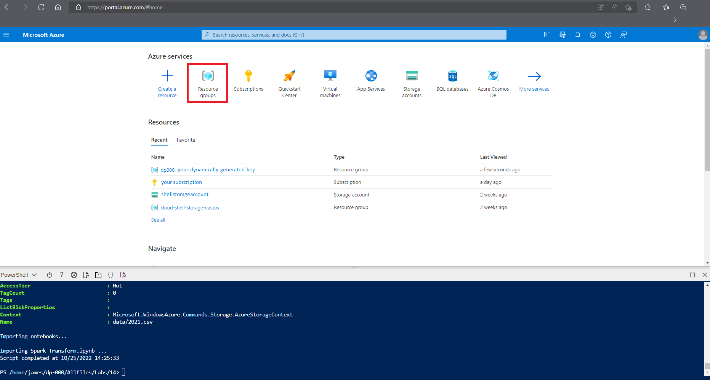
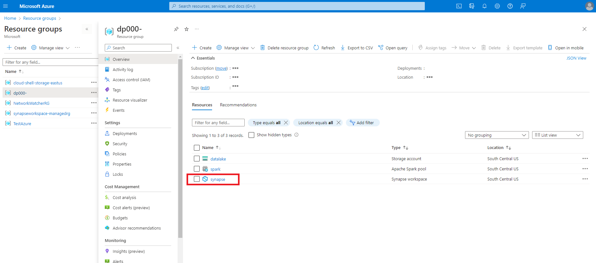
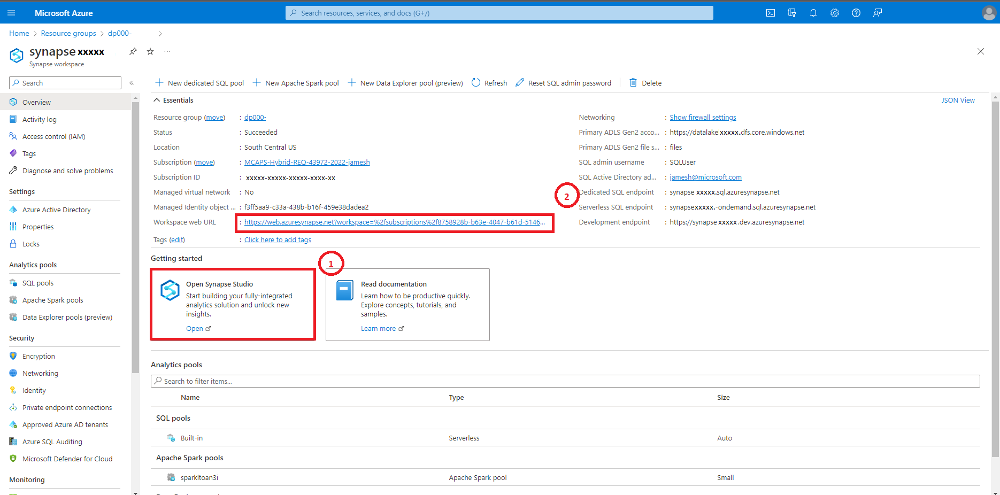
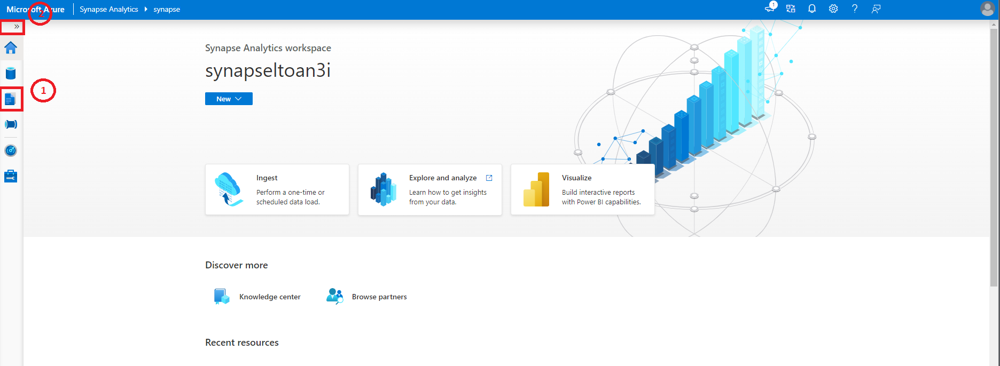
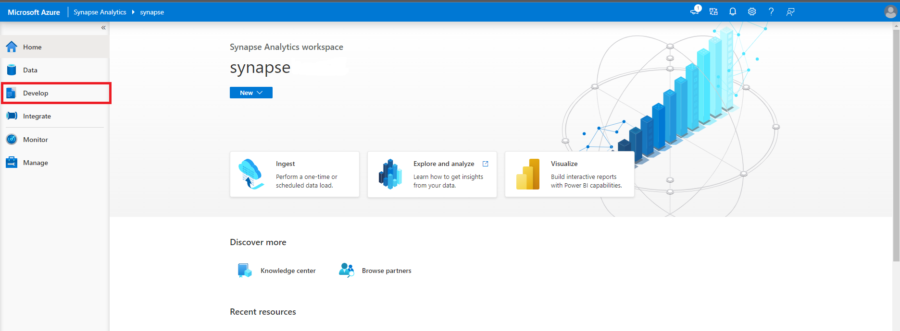
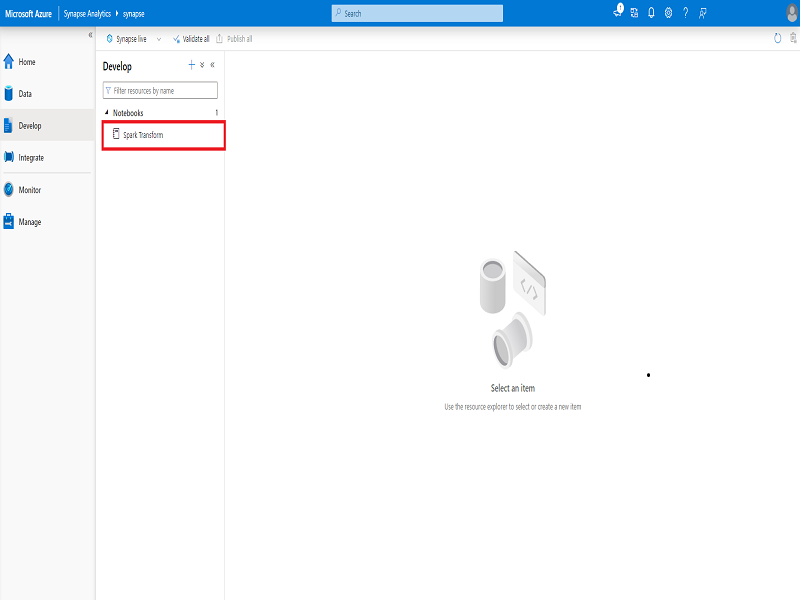

---
lab:
    title: 'Transform data using a serverless SQL pool'
    module: 'Use Azure Synapse serverless SQL pool to query files in a data lake'
---

# Transform files using a serverless SQL pool

Data *engineers* often use Spark notebooks as one of their preferred tools to perform *extract, load, and transformation (ELT)* activities.

In this lab, you'll use a serverless SQL pool in Azure Synapse Analytics to transform data in files.

This lab will take approximately **30** minutes to complete.

## Before you start

You'll need an [Azure subscription](https://azure.microsoft.com/free) in which you have administrative-level access.

## Provision an Azure Synapse Analytics workspace

You'll need an Azure Synapse Analytics workspace with access to data lake storage. You can use the built-in serverless SQL pool to query files in the data lake.

In this exercise, you'll use a combination of a PowerShell script and an ARM template to provision an Azure Synapse Analytics workspace.

1. Sign into the [Azure portal](https://portal.azure.com) at `https://portal.azure.com`.
2. Use the **[\>_]** button to the right of the search bar at the top of the page to create a new Cloud Shell in the Azure portal, selecting a ***PowerShell*** environment and creating storage if prompted. The cloud shell provides a command line interface in a pane at the bottom of the Azure portal, as shown here:

    

    > **Note**: If you have previously created a cloud shell that uses a *Bash* environment, use the the drop-down menu at the top left of the cloud shell pane to change it to ***PowerShell***.

3. Note that you can resize the cloud shell by dragging the separator bar at the top of the pane, or by using the **&#8212;**, **&#9723;**, and **X** icons at the top right of the pane to minimize, maximize, and close the pane. For more information about using the Azure Cloud Shell, see the [Azure Cloud Shell documentation](https://docs.microsoft.com/azure/cloud-shell/overview).

4. In the PowerShell pane, enter the following commands to clone this repo:

    ```
    rm -r dp-000 -f
    git clone https://github.com/MicrosoftLearning/mslearn-synapse dp-000
    ```

5. After the repo has been cloned, enter the following commands to change to the folder for this lab and run the **setup.ps1** script it contains:

    ```
    cd dp-000/Allfiles/Labs/14
    ./setup.ps1
    ```

6. If prompted, choose which subscription you want to use (this will only happen if you have access to multiple Azure subscriptions).
7. When prompted, enter a suitable password to be set for your Azure Synapse SQL pool.

    > **Note**: Be sure to remember this password!

8. Wait for the script to complete - this typically takes around 10 minutes, but in some cases may take longer. While you are waiting, review the [CETAS with Synapse SQL](https://docs.microsoft.com/azure/synapse-analytics/sql/develop-tables-cetas) article in the Azure Synapse Analytics documentation.

## Getting started
The script provisioned an Azure Synapse Analytics workspace with a Spark Pool, Built-in Serverless SQL Pool, and an Azure Storage account to host the data lake, then uploads 3 sales orders files to the data lake and a Notebook to the workspace. Let's explore and work with the data using the provided notebook by following the steps below:

1. Select the Resource Groups option in the Azure Portal window  
2. Select the resource group which begins with dp000- and has the suffix created in your script. This should still be visible in your shell window and look similar to the code output below:
   
   ```powershell
   Your randomly-generated suffix for Azure resources is xxxxxx
   ```

3. Select the Synapse-xxxxxx workspace icon within the Resource Group panel. 
4. Select the **Open Synapse Studio** under the Getting started section of the Synapse Resource panel. If this doesn't work, then you can select the link in the **Workspace web URL**. 
5. Select the Develop icon (1)  
6. Or the expand icon (2) to display the **Develop** panel. 
7. On the **Develop** panel, expand the ***Notebooks*** section and select the **Spark Transform** file. 
8. Follow the directions in the Spark notebook and then return to this page.
## Delete Azure resources

If you've finished exploring Azure Synapse Analytics, you should delete the resources you've created to avoid unnecessary Azure costs.

1. Close the Synapse Studio browser tab and return to the Azure portal.
2. On the Azure portal, on the **Home** page, select **Resource groups**.
3. Select the **dp000-*xxxxxxx*** resource group for your Synapse Analytics workspace (not the managed resource group), and verify that it contains the Synapse workspace, storage account, and Spark pool for your workspace.
4. At the top of the **Overview** page for your resource group, select **Delete resource group**.
5. Enter the **dp000-*xxxxxxx*** resource group name to confirm you want to delete it, and select **Delete**.

    After a few minutes, your Azure Synapse workspace resource group and the managed workspace resource group associated with it will be deleted.
